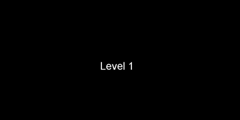
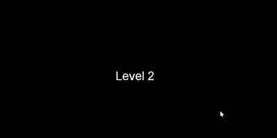
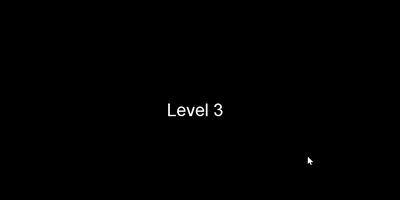
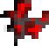
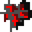
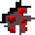
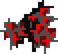
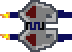
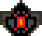

# SpaceBoy Shoot'em

This was a month long coursework project to create a Shootem up style game using C# with monogame. Monogame was used as it only allows coding.

## Controls 

W,A,S,D to move.

Click to shoot, aim with the cursor.

## User Interface

Top of the screen is the count down till the next level or end of the game.
Ammo is displayed in the bottom right cohering to conventional practice in fps games.

## Gameplay

### Level 1

To complete the first level defeat 50 enemies, conserving ammo and picking up the ammo creates.

### Level 2

To complete the second level defeat 50 faster spawning enemies, to help speed boosts have also been added.

### Level 3

To complete the third level defeat the boss with 100hp, you will need to stop the normal enemies from killing you while collecting the power ups to survive.

## Design

The design of all the characters was created by the wonderfully talented Julia Yin, who can be found at twitter.com/JayJinXi, instagram.com/littlesnowjj/, twitch.tv/jayjamy, facebook.com/littlesnowjj.3

Three sprites were created for the enemies, these were randomly choosen when the enemy was spawned.
Similarly the bullets have four different sprites which are randomly chosen from when fired.

Enemy 1-3:
  

Boss:

Bullets:
   

Player Ship:

Ammo Packs:

Speed Boost:

